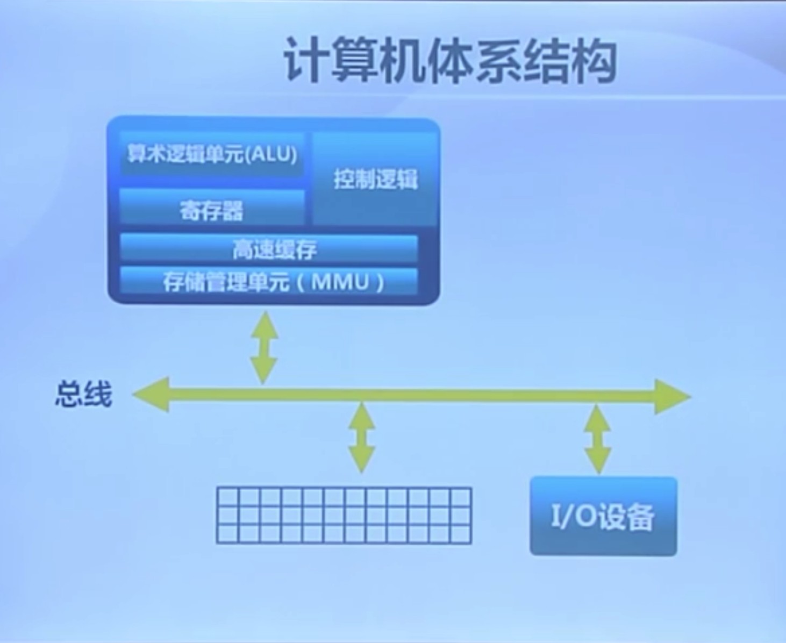
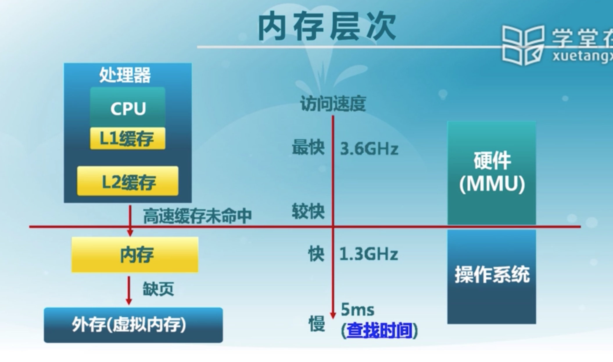
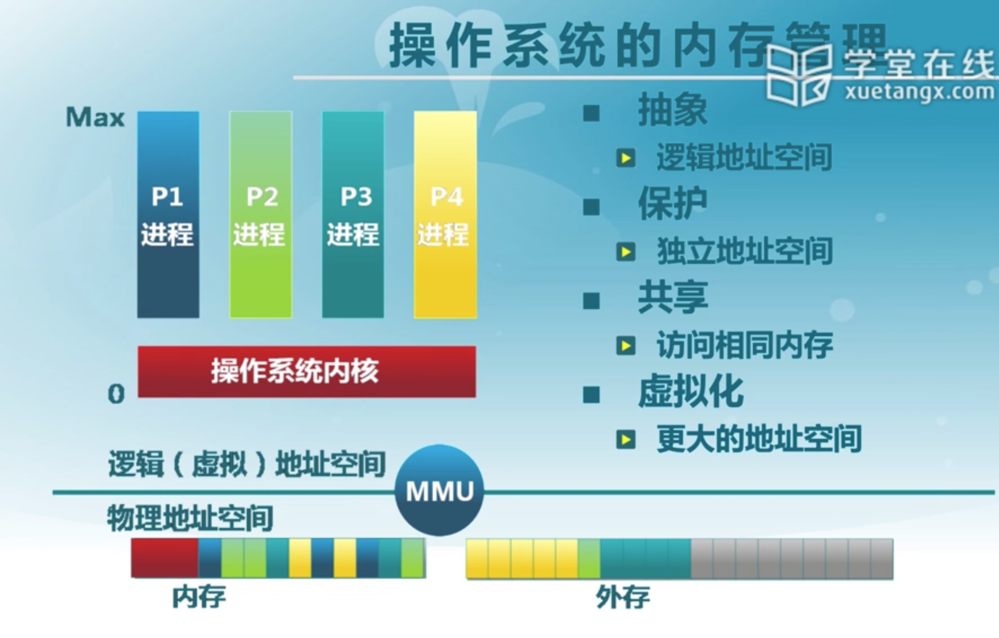
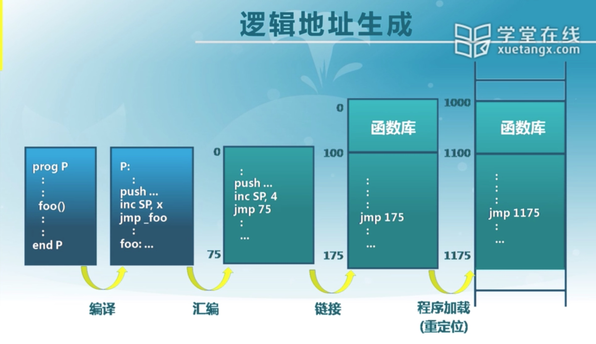

# 物理内存管理：连续内存分配

[TOC]

---

## 计算机体系结构/内存层次

### 计算机体系结构：存储管理单元需要管理的内容

### 内存层次：CPU中内存层次及访问速度

### 操作系统内存管理的目标

### 操作系统的内存管理方式

最早的计算机是直接使用物理地址作为应用程序的地址来使用的，这样一来，编写好的应用程序只能在特定的机器上工作所以，人们开始用不同的地址映射方式，来使得应用程序运用内存更加方便

- 重定位（relocation）
- 分段（segmentation）
- 分页（paging）
- 虚拟存储（virtual memory）

---

## 地址空间&地址生成

- 物理地址空间：硬件支持的地址空间（32bits/64bits）
  - 从0开始到$MAX_{sys}$
- 逻辑地址空间：在CPU运行的时候进程看到的地址空间
  - 从0开始到$MAX_{program}$

### 逻辑地址的生成过程

---

## 连续内存分配

指给进程分配一块不小于指定大小的连续的物理内存区域

- 动态分区分配
  - 当程序被加载的时候，分配一个进程指定的大小可变的内存块
  - 操作系统需要维护的数据结构：
    - 所有进程已分配分区
    - 空闲分区
  - 动态分区分配策略：
    - 最先匹配
    - 最优匹配
    - 最差匹配
- 碎片整理
  - 通过调整进程的占用的分区位置来减少或避免分区碎片
  - 碎片紧凑（Compaction）：
    - 通过移动分配给进程的分区，以合并外部碎片
    - 碎片紧凑的条件：所有的应用程序可以动态重定位
  - 分区对换（Swapping in/out）:
    - 如果内存中没有空间了，就将内存中处于等待状态的进程对换到外存中，从而使得内存中能够获得更多的空间

---

## 伙伴系统：连续内存分配的一个实例

