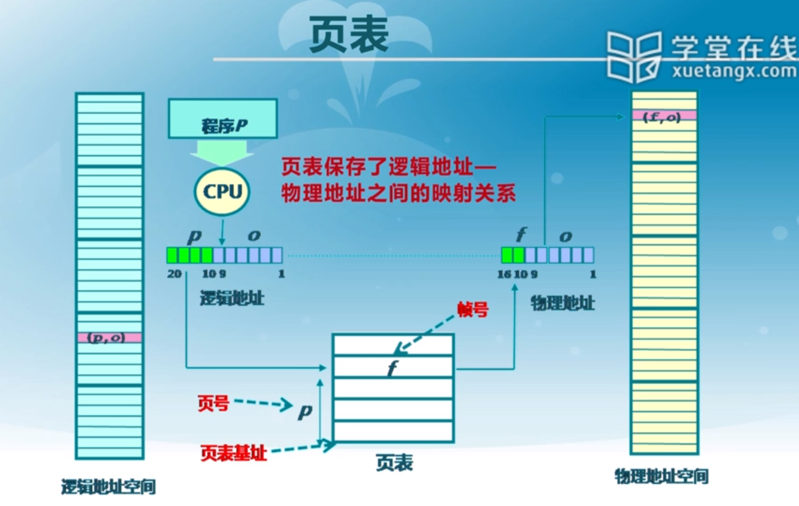

# 物理内存管理：非连续内存分配

[TOC]

## 非连续内存分配的需求背景

### 连续分配的缺点

- 分配给程序的物理内存必须连续
- 存在外碎片和内碎片
- 内存分配的动态修改困难
- __内存的利用效率低__

### 非连续内存分配

- 允许一个程序使用非连续的物理地址空间
- 允许共享代码与数据
- 支持动态加载和动态链接
- __提高内存的利用效率和管理灵活性__

## 段式存储管理

### 段地址空间

进程的段地址空间由多个段组成

- 主代码段；
- 子模块代码段；
- 共用库代码段；
- 堆栈段；
- 堆数据；
- 初始化数据段；
- 符号表等

### 段访问机制

- 段表示访问方式和存储数据等属性相同的一段地址空间
- 一个段对应一个连续的内存"块"
- 若干个段组成进程的逻辑地址空间
- 访问的时候：
  - 逻辑地址由二元组（s，addr）表示
  - s——段号
  - addr——段内偏移
- 访问的过程：
  - CPU的到进程的逻辑地址，逻辑地址包含两个部分，段号+段内偏移
  - 用段号作为index，在段表（GDT）中查找段描述符（Segment descriptor），得到段基址+段长度
  - MMU会取出 （1） 逻辑地址的段内偏移，（2）段描述符的长度信息，将两者进行比较
  - 如果段内偏移 __大于__ 段的长度，越界，报告内存异常
  - 如果正常，通过段基址+段内偏移找到相应的物理地址

## 页式存储管理

### 页式存储管理的概念

- 页帧（Page Frame、物理页面）
  - 把物理地址空间划分位大小相同的基本分配单位
  - 通常为2的n次方
  - 访问的时候：
    - 内存的物理地址可以表示为：二元组（frame，offset）
    - 物理地址 = frame * 页帧大小 + offset
- 页面（Page、页面）
  - 把逻辑地址空间也划分位相同大小的基本分配单位
  - 帧和页面的大小是一样的
  - 访问的时候：
    - 进程的逻辑地址可以表示为：二元组（page，offset）
    - 逻辑地址 = page * 页面大小 + offset

### 页式存储管理的地址转换

- 页表：保存了逻辑地址<->物理地址之间的映射关系

  - 执行的时候：

    - CPU得到一个逻辑地址，逻辑地址包含页号+页内偏移

    - 根据逻辑地址中的页号查找__页表__，得到物理地址的帧号

    - 用帧号 + 页内偏移得到最终的物理地址

      

## 页表

### 页表概述

- 每个进程都有一个页表
- 页表的内容随着进程的运行状态而动态变化
- 页表的基址存储在页表基址寄存器（PTBR：Page Table Base Register）
- 页表项组成：
  - 帧号：frame
  - 页表项标志
    - 存在位：某一个Page是否存在一个Frame与之对应
    - 修改位：对应页面中的内容是否被修改过
    - 引用位：页帧的内容在一段时间内是否被访问过
- 使用页表的缺点：
  1. 逻辑地址到物理地址的映射过程中间需要加一个页表，从而间接增加了内存的访问次数
  2. 64位机器，对应的地址很多，导致页表过大

### 快表TLB

- 缓存近期访问过的页表项

### 多级页表

### 反置页表

## 段页式存储管理

段式存储在内存保护方面有优势，页式存储在内存的利用和优化转移到后备存储方面有优势（内外存间相互移动）

