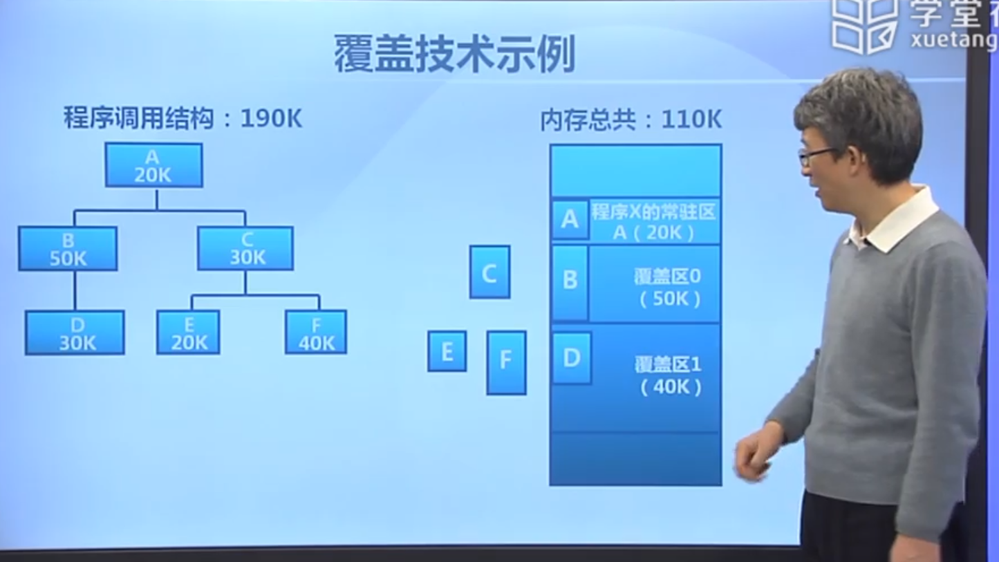
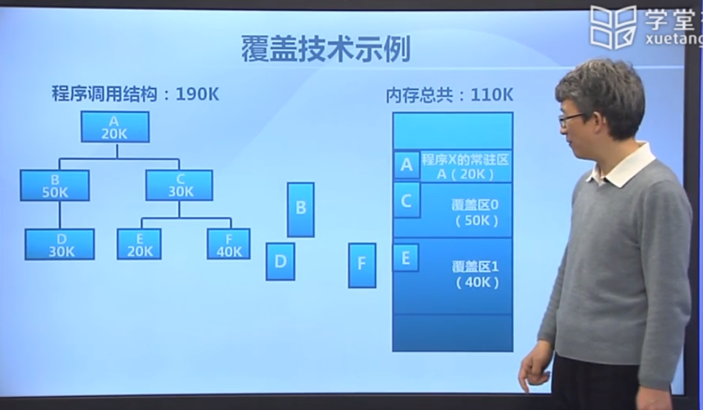
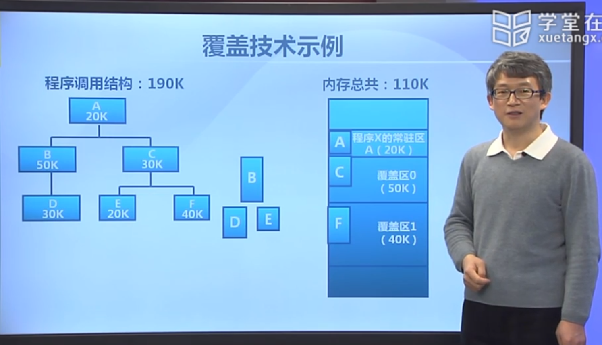

# 虚拟存储概念：虚拟存储概念

[TOC]

## 虚拟存储的需求背景

1. 增长迅速的存储需求：比如游戏

   - 理想中的存储器：要求容量更大、速度更快、价格更便宜的非易失性存储器

2. 操作系统对存储的抽象：

   

   操作系统自动建立地址空间映射关系，从而使得应用程序开发变得更加简单

## 覆盖技术（overlay）

应用程序手动把需要的指令和数据保存在内存中

- 目标：在较小的可用内存中运行较大的程序

- 实现方法：依据程序的逻辑结构，将程序划分为若干功能相对独立的模块；将不会同时执行的模块共享同一块内存区域

  - 必要部分（常用功能）的代码和数据常驻内存
  - 可选部分（不常用功能）放在其他程序模块中，只在需要用到的时候装入内存
  - 不存在调用关系的模块可以相互覆盖，共用同一块内存区域

- 一个实例：

  - 程序A一共可以被分为一下6个逻辑块，其中A会调用B、C，B调用D，C调用E、F

  

  

  

- 缺点：

  - 增加编程困难：程序员需要自己动手划分模块
  - 增加执行时间：从外存装入覆盖模块，时间换空间

## 交换技术（swapping）

- 目标：增加正在运行或需要运行的程序的内存
- 实现方法：
  - 可将暂时不能运行的程序放到外存
  - 换入换出的基本单位是——整个进程的地址空间

操作系统自动把暂时不能执行的程序保存到外村中

## 局部性原理

## 虚拟存储概念

## 虚拟页式存储

## 缺页异常